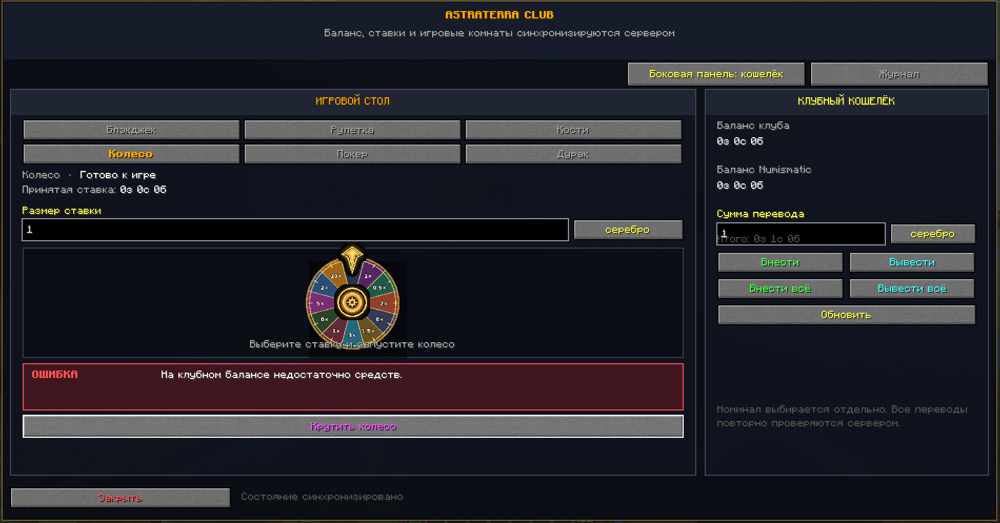
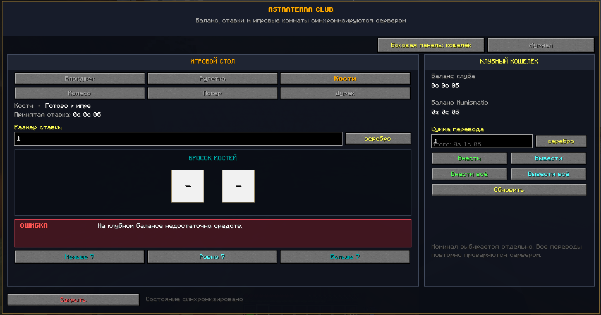
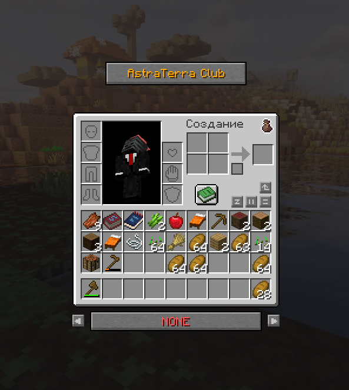

# AstraTerra Casino

[English](README.md) · [Русский](README.ru.md)

A server-authoritative casino mod for **Minecraft 1.20.1**, built for **Fabric** and **Java 17**. Version 0.9.5 includes blackjack, private poker and Durak rooms, and the animated Expedition Wheel with Numismatic Overhaul currency support and FTB Quests statistics.

## Screenshots

### Expedition Wheel and club wallet



### Dice game



### Club access from the player inventory



## Download

Download the ready-to-use mod from [GitHub Releases](https://github.com/endoflife1231/AstraTerra-Casino/releases). Players only need the file named `astraterra-casino-0.9.5+mc1.20.1.jar`; the automatically generated “Source code” archives are for developers.

## Installation

1. Install Minecraft 1.20.1, Java 17 and Fabric Loader 0.15.3 or newer.
2. Install the required mods listed below.
3. Remove older `astraterra-casino` versions from the `mods` directory.
4. Put `astraterra-casino-0.9.5+mc1.20.1.jar` into the `mods` directory on both the client and server.
5. Make sure every client and the server use the same mod version.

Existing FTB Quests configuration does not need to be replaced.

## Required dependencies

- [Fabric API](https://modrinth.com/mod/fabric-api)
- [Numismatic Overhaul](https://modrinth.com/mod/numismatic-overhaul) 0.2.17 or newer
- [owo-lib](https://modrinth.com/mod/owo-lib) 0.11.2 or newer
- FTB Quests 2001.1.0 or newer
- FTB Library
- FTB Teams

## Features

- server-authoritative game results and payouts;
- animated 12-sector Expedition Wheel;
- blackjack, poker and Durak;
- private multiplayer rooms;
- adaptive casino interface;
- Russian and English in-game localization;
- duplicate-payout protection and spin restoration;
- FTB Quests statistics integration.

See [CHANGELOG.md](CHANGELOG.md) for the complete 0.9.5 change list.

## Client options

```text
-Dastraterra.casino.wheel.disableAnimation=true
-Dastraterra.casino.wheel.reducedAnimation=true
-Dastraterra.casino.wheel.disableSounds=true
-Dastraterra.casino.wheel.particles=OFF|LOW|NORMAL
```

## Source and build status

The complete Java sources, resources and self-test are published in [`src`](src). The supplied 0.9.5 source snapshot uses Minecraft's intermediary class names and does not include the original Gradle/Loom build configuration. Consequently, this repository currently documents and exposes the source but does **not** yet provide a supported one-command reproducible build. See [BUILD-NOTES-RU.md](BUILD-NOTES-RU.md) and [validation notes](docs/VALIDATION-0.9.5-RU.txt).

The release JAR is a Java archive, not a Windows DLL.

## Compatibility

Do not mix versions 0.9.4 and 0.9.5 between clients and the server because their network protocols differ.

## License

Code and original project assets are available under the [MIT License](LICENSE). Third-party asset information is listed in [ASSET-LICENSES-RU.md](ASSET-LICENSES-RU.md).
